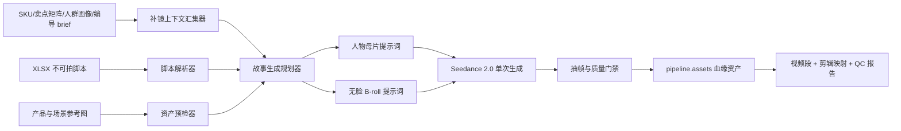
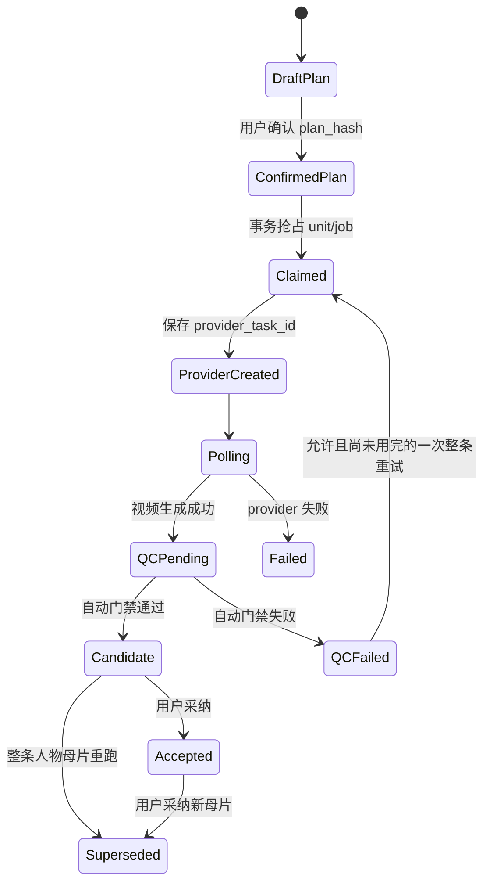

# AI 补镜人物母片功能设计

> 日期：2026-07-16
> 状态：设计待确认，尚未实施
> 目标模型：`doubao-seedance-2-0-260128`
> 首个验收样本：`短视频脚本.xlsx` + SKU-367991-0002 产品白底图

## 1. 问题与目标

现有链路已经完成：SKU 产品分析 → 卖点矩阵 → 人群匹配 → 人群画像 → 编导 brief → 短视频脚本。编导拿到脚本后，仍会遇到真人团队无法拍摄的画面。本功能负责把这些“拍不了的镜头”转换为 AI 视频补镜，交给编导与真人素材混剪。

本功能不是重新写一套脱离 Omni 的视频脚本，也不是直接把整条短视频全做成纯 AI 成片。它必须：

1. 继承原有 SKU、卖点、人群、痛点、场景、解决问题、表达对象和表达方式的血缘。
2. 以编导给出的不可拍脚本片段为第一约束，不擅自换故事。
3. 使用产品白底图保证产品外观，缺资产时明确拦截，禁止臆造标签、规格、认证和包装角度。
4. 产出可直接混剪的独立视频素材、提示词、原脚本映射和质量报告。
5. 同一个故事只要涉及可识别人脸，所有 AI 露脸镜头必须来自同一次人物母片生成，不能通过多次调用“碰运气锁脸”。

## 2. 已确认的产品规则

### 2.1 人物一致性规则

- 无人脸内容可以按混剪需要拆成独立 B-roll 补镜。
- 同一个故事内，只要存在必须露脸的 AI 镜头，就把该故事全部露脸动作编入一条 `face_master` 人物母片，一次调用 Seedance 生成。
- 编导需要多个露脸片段时，从同一条人物母片按时间码截取，不再分别生成。
- 人物母片使用一份不可变的“演员表”：每个角色有稳定 `character_id`、角色作用、年龄段、脸型、肤色描述、五官特征、发型、体型、气质和习惯动作。身份锚点全程不可变；服装与场景另存为脚本允许变化的 `look_state / scene_state`。它只描述虚构 AI 演员；不从人群画像推断敏感身份属性。
- 仅靠同一段人物文字进行多次生成不能视为锁脸方案。
- 人物母片生成后必须抽帧检查。同一人物出现明显换脸、五官漂移、年龄漂移、服装漂移、无故增加人物时，判定不合格。
- 自动检查只能初筛，不能承诺模型必然不换脸。系统保证的是“同一故事所有含脸交付件来源于同一个被采纳人物母片”，并由用户看完整母片与关键帧联系表后确认是否采纳。
- 每个故事最多只能有一个 `accepted_face_master_asset_id`。人物母片重试必须整条重跑；一旦采纳新母片，旧母片及其所有截取片段、时间码映射立即作废，禁止把两个生成任务的人脸镜头混在一起。
- 所有非人物母片输出都必须做人脸检测。B-roll 一旦出现可识别人脸，返回 `unexpected_face_outside_master`，不得进入交付包。
- 从人物母片无损截取的 `face_cut` 可以有多个，但它们必须记录同一个 `source_master_asset_id`；截取不是再次调用视频模型。

### 2.2 时长规则

- 当前 Omni Seedance API 的单次视频时长按 4–15 秒处理。
- `face_master` 必须完整落在一次不超过 15 秒的调用里。
- 系统可以把非必要露脸动作改写成手部、背影、POV、产品或环境 B-roll，以压缩人物母片，但不得删除原脚本的核心情节和卖点证明动作。
- 如果必须露脸的内容压缩后仍超过 15 秒，返回 `face_story_too_long`，禁止自动拆成两次人脸生成。用户需缩短露脸内容，或改走已授权真人/其他生产通道。
- 小于 4 秒的无人脸片段应与同场景相邻片段合并，或把动作扩写到 4 秒；不得静默把 3 秒内容请求成 4 秒后导致脚本映射错位。
- `face_optional` 改成手部、背影或 POV 属于脚本改写，必须展示“原画面 → 拟改画面”的差异并由用户确认。脚本明确要求露脸时默认归入人物母片。

### 2.3 Seedance 输入模式规则

- 默认使用多参考图 `reference_image` 模式：产品白底图 + 必要的场景/风格参考图。
- 人物母片默认不上传普通真人人脸图片，仅在提示词中写虚构人物描述；若使用真人，只接受方舟已授权的 `asset://` 素材或既有合规真人通道。
- 显式首帧、首尾帧与多参考图属于互斥模式，不能为了首尾帧静默丢掉产品参考图。
- 首尾帧不是主路径。仅当片段不含可识别人脸、无需其他参考图且用户主动选择时，才允许实验性使用。
- 不采用遮挡、网格覆盖等方式绕过平台人脸审核。

## 3. 方案比较

### 方案 A：整条 25–30 秒故事一次生成

优点是人物天然来自同一输出。缺点是超过当前 API 15 秒上限，无法作为稳定可交付能力。否决。

### 方案 B：每个脚本行分别生成，重复同一人物描述

优点是编辑灵活。缺点是多次生成仍会换脸，无法满足“一个故事的人脸一致”。否决。

### 方案 C：人物母片 + 无脸 B-roll（采用）

同一故事所有露脸内容只生成一次人物母片，编导再从母片截取；产品、食物、环境、手部等无脸镜头独立生成。它保证人脸素材来源单一，并通过自动初筛和人工采纳控制一致性，同时满足人工混剪和 API 时长约束。

## 4. 用户流程

功能入口放在 Content Studio，新增“编导脚本 AI 补镜”，不重新开放旧 `/sku-pipeline` 隐藏的内容制作步骤。

1. **选择血缘**：选择 SKU 和上游编导 brief。系统自动带出 matrix、audience record、portrait、selling points、intent。
2. **导入脚本**：上传 `.xlsx`；同时选择或上传产品白底图、场景参考图和可选的已授权人物资产。
3. **解析预览**：展示识别到的故事、原脚本时间段、画面、台词、产品露出和未解决占位符。
4. **生成计划**：逐故事标记 `face_required / face_optional / face_free`，展示所有拟无脸化改写，生成一条人物母片计划和若干无脸 B-roll 计划。
5. **资产预检**：对每个生成单元检查产品角度、规格、包装组合、背标、认证资料和真人授权状态。
6. **提示词预览**：先展示最终会提交给 Seedance 的完整提示词、参考图顺序、时长、原脚本映射，以及正常成本/含一次重试的最坏成本。用户确认 plan hash 后才烧视频生成费用，并可关闭自动重试。
7. **选择生成**：支持按故事勾选，避免一次性烧完 14 个故事。人物母片始终作为不可拆分单元。
8. **质量门禁**：生成成功后执行人物、产品、脚本覆盖和技术可用性初筛；人物母片还要展示完整视频和关键帧联系表，由用户确认采纳。
9. **交付编导**：仅使用已采纳人物母片，下载视频段、剪辑映射表、提示词、资产清单、质量报告和 AI 生成标识说明。局部重跑只适用于 B-roll；人物母片只能整条重跑。

## 5. 数据流与组件



### 5.1 XLSX 脚本解析器

输入支持 `.xlsx`，解析后规范化为：

```json
{
  "story_id": "script-01",
  "title": "脚本标题",
  "declared_duration_s": 29,
  "segments": [
    {
      "source_row": 4,
      "start_s": 0,
      "end_s": 4,
      "visual": "画面内容",
      "dialogue": "台词/字幕",
      "product_exposure": "产品露出方式"
    }
  ]
}
```

解析器需要处理合并单元格、重复表头、缺失时长、空白边界行和中文时间范围。每个导入文件计算 SHA-256；同一文件、同一 brief、同一规划版本重复提交时返回已有预览，防止重复生成费用。

### 5.2 血缘上下文汇集器

上下文按优先级读取：

1. SKU 确定性字段、产品规格和已注册产品参考资产。
2. 采纳的卖点矩阵及证据等级。
3. 被选中的 audience record 和 audience portrait。
4. 编导 brief 中的痛点、场景、情绪触点、表达对象、表达地点、表达方式和算法信号。
5. 当前导入的原脚本行。

系统必须输出 `evidence_map`，说明每个提示词事实来自哪个 SKU 字段、矩阵条目、画像段落、brief 段落或脚本行。没有来源的产品事实不得进入提示词。

该汇集器必须是 fail-closed 的专用实现，不能直接复用当前会缺资料仍继续的 `gather_lineage_context`。卖点文字也不能自动推导视觉资产，例如看到“有机”就假设画面里存在可读认证标；只有真实上传并登记的证书/包装参考资产才能解锁对应镜头。所选 SKU、director brief 和 Excel 内容匹配置信度不足时，先展示差异并阻塞确认。

### 5.3 故事生成规划器

规划器逐段判断：

- `face_required`：情节必须看到人物正脸或可识别表情才能成立。
- `face_optional`：可以换成背影、手部、POV、遮挡构图而不破坏故事。
- `face_free`：产品、食物、环境、道具、字幕等无需露脸。

随后输出：

```json
{
  "story_id": "script-01",
  "character_bible": [
    {
      "character_id": "char-01",
      "role": "故事主角",
      "identity_anchor": {},
      "look_states": []
    }
  ],
  "visual_bible": {},
  "generation_units": [
    {
      "unit_id": "script-01-face-master",
      "kind": "face_master",
      "duration_s": 12,
      "source_segment_ids": [1, 3, 5],
      "editor_ranges": []
    },
    {
      "unit_id": "script-01-broll-01",
      "kind": "broll",
      "duration_s": 5,
      "source_segment_ids": [2]
    }
  ]
}
```

所有 `face_required` 以及保留下来的 `face_optional` 内容必须只属于一个 `face_master`。规划器不得产生第二个人物母片，也不得在失败时自动拆分。

手部、背影、半身等虽然不露正脸，但如果明显属于故事主角，应标为 `character_linked_broll`，继承对应角色的体型、肤色可见特征、服装和配饰状态，并接受连续性检查；关键人物动作优先保留在人物母片。纯产品/环境镜头才标为普通 `broll`。

每个生成单元还要保存不可变的源映射：工作表、Excel 原始行、原脚本时间码、计划后时长、建议剪入位置、母片入出点、前后手柄余量、字幕/配音处理和确认时参考资产 hash。

### 5.4 提示词编译器

提示词不是分镜关键词列表，而是一段带连续时间码的自然中文故事描述。每个提示词必须包含：

1. **任务定义**：9:16、时长、真实生活质感、与真人素材混剪用途。
2. **人物圣经**：人物固定外貌、服饰、气质和禁止变化项。
3. **场景圣经**：空间布局、时间、光线、色调、道具位置和镜头质感。
4. **产品锚点**：参考图编号、准确规格、标签朝向、允许的产品动作。
5. **时间码故事**：每个动作、表情、运镜、产品露出和台词/环境音发生的时间。
6. **一致性约束**：同一人物、同一服装、同一产品、同一场景逻辑，不增加角色。
7. **负向约束**：禁止包装变形、错字、手指畸形、人物换脸、跳切破坏动作因果、虚构认证或功效。
8. **剪辑映射**：内部时间范围对应哪些原脚本行。

人物母片的每次尝试都只提交一条完整任务；允许的重试也是整条替换，绝不把两次任务拼接。无脸 B-roll 使用相同 `visual_bible`，从而保持场景、光线和产品一致。

### 5.5 生成调用

- Provider：Seedance。
- Model：`doubao-seedance-2-0-260128`。
- 默认比例：9:16。
- 默认模式：多参考图 r2v。
- 时长：4–15 秒。
- 人物母片：不传普通真人人脸首尾帧；人物由文字角色圣经定义，产品/场景图作为 `reference_image`。
- 无脸 B-roll：产品图和场景图作为 `reference_image`。
- 请求前保存最终 prompt、参考图有序清单及 SHA-256；请求后保存 provider task id、模型、耗时和原始错误分类。
- Provider 层必须做最后一道 fail-closed 校验：时长不在 4–15 秒直接拒绝，禁止静默 clamp；`first_frame/last_frame` 与 `reference_images` 同时出现直接拒绝；普通真人人脸 URL 不能由调用方绕过功能预检。

## 6. 质量门禁

HTTP 成功不等于素材可用。每个输出都要经过：

### 6.1 人物母片门禁

- 抽取每个露脸镜头的首、中、尾关键帧。
- 检查角色数量、人物身份稳定、年龄/发型/服装/配饰稳定。
- 检查动作因果连续，避免镜头切换后换人。
- 检查人物是否与角色圣经冲突。
- 复用现有视频 prescreen 的多模态评审维度，但 AI 判分只做初筛：`face_consistency < 7`、可用性不达标或出现额外人物时 fail-closed。
- 任一关键镜头明显换脸时，状态为 `qc_failed`。用户在确认页开启自动重试时，才使用同一规划整条重试一次；第二次仍失败则停止，不拆段。
- 自动初筛通过后仍是 `candidate`，必须由用户看完整母片和联系表并点“采纳”，才能成为该故事唯一的 `accepted_face_master_asset_id`。
- 新母片被采纳时，旧母片状态改为 `superseded`，所有旧 `face_cut` 和 `edit_map` 立即失效；失败、旧版和重试版之间禁止混剪。

### 6.2 B-roll 人脸与人物连续性门禁

- 普通 `broll` 必须确认没有可识别人脸；发现人脸返回 `unexpected_face_outside_master`。
- `character_linked_broll` 允许手部、背影或无脸半身，但必须检查角色的服装、配饰、体型和可见肤色特征与对应 `look_state` 一致。
- `character_linked_broll` 若意外露出可识别人脸，同样失败，不能作为人物母片的第二来源。

### 6.3 产品门禁

- 产品品类、瓶型、瓶盖、标签主色、容量和组合数量与参考资产一致。
- 需要读清文字的镜头必须做 OCR/视觉检查；无法保证时不得冒充“已通过”。
- 参考资产没有覆盖的背标、200ml 小瓶、四瓶套装或证书，不允许模型凭空补齐。

### 6.4 脚本覆盖门禁

- 每条原脚本行必须映射到人物母片时间段、B-roll、`blocked_missing_asset` 或 `user_skipped` 状态之一。由于导入范围本来就是编导拍不了的内容，系统不得自动退回“由真人拍摄”；只有用户主动排除时才可 `user_skipped`。
- 核心卖点证明动作、痛点和解决动作不能丢失。
- 台词无需强制由视频模型生成；可以标记为后期配音/字幕，避免口型和中文文字质量拖累画面。

### 6.5 技术门禁

- 视频文件可解码、分辨率和比例正确、实际时长与计划一致。
- 无黑帧、长时间静止、闪烁、明显水印异常。
- AI 内容安全审核通过。

## 7. 落库与血缘

不能只把 plan/job 塞进可覆盖的 JSON。为了保证“确认后不可变”、防重复扣费和进程重启续查，需要新增少量正式状态表；Content Studio 只做工作区和读模型，Pipeline 继续做血缘事实源。

### 7.1 Content Studio 作为工作区

给 `content_studio.pipelines` 增加：

- `workflow_type = ai_insert`。
- `workflow_schema_version`。
- `ai_insert_plan_id`。
- `skip_final_concat=true`：默认不自动拼整条成片，交付独立素材给编导。

页面需要的解析结果、人物圣经和 video results 可以投影到 namespaced `ai_insert_*` 响应中，但现有 `script_result / character_profiles / video_results` 不能再被当作权威存储，也不能改变其旧格式。旧 Content Studio 自动流水线看到 `workflow_type=ai_insert` 时必须 fail-closed，禁止按旧 scenes 流程误跑。

### 7.2 Pipeline 作为正式血缘

- 每个故事保存为一条 `pipeline.scripts`，新增 kind：`video_ai_insert`。
- 新增 `pipeline.scripts.source_director_brief_id` 外键，指向真正的 `director_brief`。`parent_script_id` 继续只表示同类脚本版本链，禁止挪作派生关系。
- 使用 `content_contract.version = ai_insert.2026-07-16.v1`，保存人物母片不可拆分规则、生成单元清单、证据映射和参考资产要求。
- 扩展 `scripts_kind_check` 和 Python 严格枚举；新增专用 repository，数据库写入失败必须抛稳定错误，不能沿用会静默返回 `None` 的旧保存函数。

新增 `pipeline.ai_insert_plans`：

- `id / workspace_pipeline_id / sku_id / source_director_brief_id`。
- `source_workbook_name / source_workbook_sha256 / schema_version`。
- `plan_json / plan_hash / confirmed_plan_hash`。
- `status = draft | confirmed | generating | review | completed | partial_failed | archived`。
- `confirmed_at / created_at / updated_at`。

新增 `pipeline.ai_insert_units`：

- `id / plan_id / story_script_id / story_id / unit_id`。
- `kind = face_master | face_cut | broll | character_linked_broll`。
- `source_sheet / source_rows / source_time_ranges / editor_ranges`。
- `duration_seconds / final_prompt / prompt_hash / reference_manifest`。
- `status = planned | ready | generating | qc_pending | candidate | accepted | qc_failed | blocked | superseded | cancelled`。
- `accepted_asset_id / source_master_unit_id / created_at / updated_at`。

新增 `pipeline.ai_insert_jobs`，每次 provider 尝试一行：

- `id / unit_id / attempt_no / request_hash`。
- `provider / model / provider_task_id`。
- `status = claimed | provider_created | polling | generated | qc_pending | qc_failed | candidate | failed | cancelled`。
- `error_category / error_detail / raw_result / claimed_at / completed_at`。
- 唯一幂等键至少覆盖 `(unit_id, attempt_no)` 和 `request_hash`；`provider_task_id` 非空时唯一。

生成结果仍保存到 `pipeline.assets`，但补充：

- `ai_insert_unit_id` 外键。
- `source_master_asset_id` 自引用外键，所有 `face_cut` 指向唯一被采纳母片。
- `qc_status / qc_report / attempt_no`。
- 失败尝试保留用于审计，但不得被 adopted/published 查询当成可用素材；旧母片采纳被替换后标记为 superseded/discarded。

`pipeline.v_asset_full_lineage` 和 `pipeline_get_asset_lineage` 需要追加 director brief、plan、unit、工作表/Excel 行、unit kind、master/editor ranges、参考图 manifest 和 QC 信息。最终每个视频文件都能反查：SKU → 卖点矩阵 → 人群 → 画像 → 编导 brief → Excel 原始行 → 生成单元 → Seedance job → QC/采纳结果。

### 7.3 状态机与幂等



worker 必须先在数据库事务中 claim job，再创建 provider task；拿到 task id 后立即持久化。进程崩溃或超时后只续查既有 task id，禁止重新创建。确认后的 `plan_hash / prompt_hash / reference_manifest` 任何一个变化都必须生成新 plan 版本，不能原地改。

### 7.4 正式生成核心的归属契约

现有正式出片把 A/B experiment arm 写死在内容门禁、参考图 manifest 和资产落库里；本功能不能绕过它，也不能为了补镜虚构实验。实施时应把正式生成公共能力抽成共享核心，并支持二选一归属：

```json
{"owner_kind":"experiment_arm","owner_id":"..."}
```

或：

```json
{"owner_kind":"ai_insert_unit","owner_id":"..."}
```

共享核心负责 contract 校验、最终 prompt 防篡改、参考图有序 manifest、provider task 持久化、资产落库和错误分类。原 `generate_video_segments` 继续走 `experiment_arm`；新补镜服务走 `ai_insert_unit`。这样既不复制一套会漂移的门禁，也不强迫补镜进入无意义的 A/B 实验。

## 8. API 与工具边界

服务逻辑集中在可复用 service 层，REST 页面和 MCP tool 调同一份实现，避免两套规则漂移。

建议新增三个受审计工具：

1. `plan_ai_insert_videos`
   - 输入：xlsx 路径/上传 id、director brief id、产品参考 asset ids、可选故事列表。
   - 输出：解析结果、生成计划、人物圣经、最终提示词预览、资产缺口、成本估算、trace。
   - 不调用视频模型。

2. `generate_ai_insert_videos`
   - 输入：plan id、前一步返回的 `confirmed_plan_hash`、story ids、是否允许一次自动重试。
   - 动作：原子确认 plan hash、创建并 claim jobs，返回 job ids；不要求 HTTP/MCP 连接一直等视频完成。
   - 必须校验 prompt/reference manifest hash，禁止前端在确认后偷偷改 prompt 或参考图。

3. `get_ai_insert_generation`
   - 输入：plan id 或 job ids。
   - 输出：任务进度、人物母片/B-roll 候选、QC、采纳状态、剪辑映射和失败项。
   - 只续查已存在的 provider task，不创建重复任务。

对应 REST 路由放在 `/api/v1/content-studio/ai-inserts/*`，长任务返回 job id 并轮询进度，前端不使用一个无限等待的同步请求。

三个工具都必须加入 `doctor.wanted`，使用 `@tool_with_audit`，返回 trace，并在 UI 输出区挂 `OutputFeedback`。所有 LLM prompt 外置到 `config/prompts/ai_insert_plan.*`、`ai_insert_prompt.*`、`ai_insert_qc.*`，接入 `pipeline.ai_insert_*` prompt-rule 节点，不能把业务规则硬编码在 Python 中。

## 9. 失败处理

所有错误都返回稳定错误码和可执行提示，不静默降级：

| 错误码 | 处理 |
|---|---|
| `xlsx_parse_failed` | 标出 sheet/行号和缺失字段 |
| `lineage_missing` | 要求选择 SKU/上游 brief，禁止裸生成 |
| `source_match_low_confidence` | 展示匹配差异并要求确认 |
| `unresolved_placeholder` | 标出未填写的脚本占位符，禁止生成相关故事 |
| `product_reference_missing` | 明确缺少的规格/角度/组合/证书 |
| `real_face_input_forbidden` | 引导使用虚构人物描述或授权 asset |
| `face_story_too_long` | 不拆人物段，要求压缩或换生产通道 |
| `unexpected_face_outside_master` | B-roll 意外露脸，禁止交付或改回人物母片重新规划 |
| `seedance_content_sensitive` | 展示是哪个输入单元失败，不归因成“只有首帧问题” |
| `face_consistency_failed` | 用户允许时整条母片重试一次；仍失败则停止 |
| `product_consistency_failed` | 保留失败素材用于审计，不交付为可用素材 |
| `provider_timeout` | 可安全续查原 task id，禁止重复创建任务 |
| `plan_hash_mismatch` | 确认后 prompt/参考图被改动，要求生成新 plan 版本 |
| `source_lineage_mismatch` | SKU、director brief 或 Excel 来源不一致，禁止落资产 |

## 10. 当前验收样本的已知事实

`短视频脚本.xlsx` 当前解析结果：

- 1 个工作表，14 个故事，共 70 个脚本片段，每个故事 5 段。
- 源 brief 可定位到 `SKU-367991-0002` 的 14 条短视频脚本。
- 存在若干 3 秒片段，需要按同场景合并或动作扩写后再调用 API。
- 有一处未解决占位符：`【填写审核批准有机认证标准表述】`，相关故事必须拦截，不能生成认证内容。
- 当前提供的白底图是 500ml 正面单瓶图。
- 脚本中还出现 200ml 小瓶、500ml×2+200ml×2 全套、背标和认证证明画面。对应资产尚未提供，相关镜头必须显示资产缺口，不能用当前单瓶正面图臆造。

首轮端到端验收不要求一次烧完 14 条。先选 1 条含人物的故事和 1 条无人物故事：

1. 含人物故事必须只生成 1 条人物母片，原脚本多个露脸片段映射到该母片内部时间码。
2. 无人物故事可生成多个 B-roll，但每段满足 4–15 秒并共享产品/场景锚点。
3. 两条故事均能反查 SKU、卖点、人群、画像、编导 brief、原 Excel 行和参考图 hash。
4. 生成包能直接交给编导混剪。

## 11. 测试与验收

### 后端单元测试

- Excel 合并单元格、重复表头、缺失时长和中文时间范围解析。
- XLSX 限制文件大小、工作表数、最大行列、公式和异常 merged range；使用 read-only 解析防止超大文件拖垮服务。
- 样本文件稳定得到 14 故事、70 片段。
- 人脸分类与合并规则：一个故事最多一个 `face_master`。
- `face_master > 15s` 必须失败，绝不拆成两次生成。
- 所有非母片交付件不得含可识别人脸；所有含脸派生片段必须具有同一个 `source_master_asset_id`。
- 人物母片整条重跑并采纳后，旧母片、旧 `face_cut` 和旧 `edit_map` 必须失效。
- 3 秒 B-roll 合并后原脚本映射不丢失。
- 未解决占位符、缺产品资产、普通真人人脸 URL 都被预检拦截。
- 最终 provider 请求中人物母片没有 first/last frame，且参考图清单与确认时 hash 完全一致。
- Provider 对超时长和 first/last + reference 混用 fail-closed，不静默 clamp/清参考图。
- 并发双击、worker 崩溃、HTTP 超时和重启续查不会重复创建 Seedance 任务。
- QC 失败只在用户允许时自动整条重试一次。
- 换脸、额外人物、产品错标 golden fixtures 能稳定被门禁拦下。
- 上游 SKU/brief 不匹配、确认后参考资产 bytes 改变都会返回稳定错误。
- 新 migration schema、kind 枚举、lineage view 和旧 Content Studio/旧 `generate_video_segments` 都有回归测试。
- 每个 pipeline asset 能反查完整血缘。

### 前端测试

- XLSX 上传、解析预览、故事选择、资产缺口和提示词确认。
- 人物母片在 UI 上不可拆分；超过 15 秒显示阻塞原因。
- 人物母片只有整条重跑；局部重跑按钮只出现在 B-roll。
- 长任务进度、部分成功、局部 B-roll 重跑、取消和断线恢复。
- 旧版 Content Studio pipeline 不受新 workflow schema 影响。
- 下载 ZIP 的中文文件名、UTF-8 BOM CSV、剪辑映射和 QC 报告完整。
- 每个输出区挂 `OutputFeedback`，差评能进入现有反馈飞轮。

### 交付包结构

```text
AI补镜_批次名/
├─ 01_故事名/
│  ├─ face_master.mp4
│  ├─ face_master_contact_sheet.jpg
│  ├─ face_cut_01.mp4
│  ├─ broll_01.mp4
│  ├─ edit_map.csv
│  ├─ prompts.md
│  ├─ qc_report.json
│  └─ README_给编导.txt
├─ asset_manifest.json
├─ lineage_manifest.json
└─ AI_GENERATED_DISCLOSURE.txt
```

`edit_map.csv` 至少包含：`story_id`、原 sheet/行号、原脚本入出点、交付文件名、`source_master_asset_id`、母片入出点、建议剪入位置、前后手柄余量、音频/字幕处理、asset SHA-256、采纳状态。`README_给编导.txt` 明确说明：所有露脸片段只能取自哪一条母片，哪些历史母片/映射已经作废。

## 12. 非目标

- 不在第一版自动拼接真人素材和 AI 素材为最终广告成片。
- 不承诺通过文字描述让不同 Seedance 任务生成同一张脸。
- 不把未经授权的真人人脸作为普通首帧或参考图上传。
- 不自动补造未提供的产品角度、组合装、背标、认证和价格。
- 不用画像相似度或 AI 视觉评分代替真实投放效果判断。
- 不在第一版支持整批 14 条无确认自动出片。

## 13. 实施顺序

1. Additive migration：plan/unit/job、source director brief、asset QC/master 血缘、lineage view 和 Content Studio workflow 类型。
2. 抽取正式生成共享核心，加入 `experiment_arm | ai_insert_unit` generation owner，并补 Provider 互斥/时长硬校验。
3. XLSX 安全解析与样本测试。
4. 严格血缘上下文汇集与资产缺口预检；不能复用会 fail-open 或推导认证画面的旧快捷上下文。
5. 人脸分类、人物母片规划、外置 prompt 和不可变 plan hash。
6. plan/job service + MCP/REST 路由 + worker 断点续查。
7. Seedance 调用、任务幂等、参考图 manifest 和资产落库。
8. 视频抽帧 QC、人物联系表、整条一次重试、人工采纳和剪辑映射。
9. Content Studio UI 与下载交付包，并回归旧 Content Studio 流程。
10. 用 1 条含人物 + 1 条无人脸故事做真实小样，验收后再开放批量。

## 14. 调研依据

- 火山方舟 Seedance 2.0 创建任务 API：首帧、首尾帧和多模态参考是互斥模式，不能混用。<https://www.volcengine.com/docs/82379/1520757?lang=zh>
- Seedance 2.0 真人素材教程：普通真人人脸参考不能直接上传，应使用受信模型产物、预置虚拟人像或完成授权入库的真人资产。<https://www.volcengine.com/docs/82379/2291680?lang=zh>
- 真人人像入库指南：真人须本人同意、认证和授权，API 通过 `asset://<asset_id>` 使用。<https://www.volcengine.com/docs/82379/2315856?lang=zh>
- Omni 本地真机记录 `b4c22b0`：Seedance 2.0 的 t2v、i2v、r2v 可分别工作，但 `first_frame + reference_images` 混合输入被拒绝。
- Omni 审计库已有 `InputImageSensitiveContentDetected.PrivacyInformation` 实例，且不只发生在显式首帧任务，因此所有输入素材都必须经过隐私/人脸预检。
