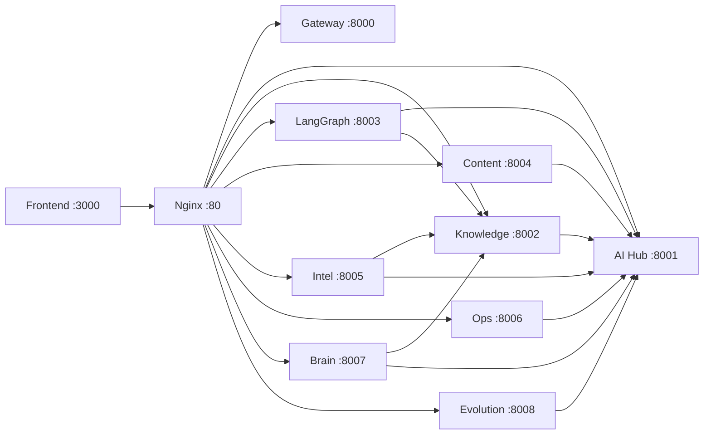

# API 接口约定 / API Contract

> 所有服务遵循统一的 RESTful 规范和数据格式。

## 通用约定 / Universal Conventions

### 基础 URL 模式
```
http://{service}:{port}/api/v1/{module}/{resource}
```

### 统一响应格式

**成功响应：**
```json
{
  "code": 200,
  "message": "success",
  "data": { ... }
}
```

**列表响应（带分页）：**
```json
{
  "code": 200,
  "message": "success",
  "data": {
    "items": [ ... ],
    "total": 100,
    "page": 1,
    "size": 20,
    "pages": 5
  }
}
```

**错误响应：**
```json
{
  "code": 400,
  "message": "Validation Error",
  "detail": "email field is required"
}
```

### 错误码表

| Code | 含义 | 场景 |
|------|------|------|
| 200 | 成功 | 正常返回 |
| 201 | 已创建 | POST 创建资源成功 |
| 400 | 请求错误 | 参数校验失败 |
| 401 | 未认证 | Token 缺失或过期 |
| 403 | 无权限 | 角色权限不足 |
| 404 | 未找到 | 资源不存在 |
| 409 | 冲突 | 重复创建（如邮箱已注册） |
| 422 | 不可处理 | 业务逻辑错误 |
| 429 | 限流 | 请求过于频繁 |
| 500 | 服务器错误 | 内部异常 |
| 503 | 服务不可用 | 依赖服务离线 |

### 认证方式
```
Authorization: Bearer <access_token>
```

### 通用查询参数
- `page`: 页码（默认 1）
- `size`: 每页条数（默认 20，最大 100）
- `sort_by`: 排序字段
- `sort_order`: asc / desc

---

## 各服务 API 清单

---

### SP#2: backend-gateway (端口 8000)

| Method | Path | 描述 | 认证 |
|--------|------|------|------|
| GET | `/health` | 健康检查 | ❌ |
| POST | `/api/v1/auth/register` | 用户注册 | ❌ |
| POST | `/api/v1/auth/login` | 用户登录 | ❌ |
| POST | `/api/v1/auth/refresh` | 刷新 Token | ❌ |
| GET | `/api/v1/auth/me` | 获取当前用户 | ✅ |

**POST /api/v1/auth/register**
```json
// Request
{ "email": "user@example.com", "password": "Test1234!", "display_name": "John" }
// Response 201
{ "code": 201, "message": "success", "data": { "id": "uuid", "email": "...", "display_name": "..." } }
```

**POST /api/v1/auth/login**
```json
// Request
{ "email": "user@example.com", "password": "Test1234!" }
// Response 200
{ "code": 200, "message": "success", "data": { "access_token": "eyJ...", "refresh_token": "eyJ...", "token_type": "bearer" } }
```

---

### SP#3: ai-provider-hub (端口 8001)

| Method | Path | 描述 | 认证 |
|--------|------|------|------|
| GET | `/health` | 健康检查 | ❌ |
| POST | `/api/v1/ai/chat` | 非流式对话 | ✅ |
| POST | `/api/v1/ai/chat/stream` | SSE 流式对话 | ✅ |
| POST | `/api/v1/ai/embedding` | 生成 Embedding | ✅ |
| GET | `/api/v1/ai/providers` | 列出可用 Provider | ✅ |
| GET | `/api/v1/ai/models` | 列出可用模型 | ✅ |

**POST /api/v1/ai/chat**
```json
// Request
{
  "messages": [
    { "role": "system", "content": "You are a helpful assistant." },
    { "role": "user", "content": "Hello" }
  ],
  "provider": "gemini",        // 可选: gemini | openai | ollama
  "model": "gemini-2.0-flash", // 可选，使用 provider 默认模型
  "temperature": 0.7,
  "max_tokens": 2048
}
// Response 200
{
  "code": 200, "message": "success",
  "data": {
    "content": "Hello! How can I help you?",
    "provider": "gemini",
    "model": "gemini-2.0-flash",
    "usage": { "prompt_tokens": 10, "completion_tokens": 8, "total_tokens": 18 }
  }
}
```

**POST /api/v1/ai/chat/stream** (SSE)
```
Content-Type: text/event-stream

data: {"content": "Hello", "done": false}
data: {"content": "! How", "done": false}
data: {"content": " can I help?", "done": false}
data: {"content": "", "done": true, "usage": {"prompt_tokens": 10, "completion_tokens": 8, "total_tokens": 18}}
```

**POST /api/v1/ai/embedding**
```json
// Request
{ "texts": ["hello world", "foo bar"], "provider": "openai", "model": "text-embedding-3-small" }
// Response 200
{
  "code": 200, "message": "success",
  "data": {
    "embeddings": [[0.01, -0.02, ...], [0.03, 0.01, ...]],
    "model": "text-embedding-3-small",
    "dimensions": 1536
  }
}
```

---

### SP#4: knowledge-engine (端口 8002)

| Method | Path | 描述 | 认证 |
|--------|------|------|------|
| GET | `/health` | 健康检查 | ❌ |
| POST | `/api/v1/knowledge/bases` | 创建知识库 | ✅ |
| GET | `/api/v1/knowledge/bases` | 列出知识库 | ✅ |
| POST | `/api/v1/knowledge/ingest` | 入库文档 | ✅ |
| POST | `/api/v1/knowledge/query` | 混合检索 | ✅ |
| GET | `/api/v1/knowledge/documents/{id}` | 文档详情 | ✅ |
| GET | `/api/v1/knowledge/graph/{kb_id}` | 知识图谱 | ✅ |

**POST /api/v1/knowledge/ingest**
```json
// Request
{
  "kb_id": "uuid",
  "title": "Product Research Report",
  "text": "Full document text...",
  "source_url": "https://example.com/report",
  "metadata": { "category": "research", "author": "John" }
}
// Response 201
{
  "code": 201, "message": "success",
  "data": {
    "document_id": "uuid",
    "chunks_count": 15,
    "entities_count": 8,
    "relations_count": 12
  }
}
```

**POST /api/v1/knowledge/query**
```json
// Request
{ "kb_id": "uuid", "query": "What are the market trends?", "top_k": 10 }
// Response 200
{
  "code": 200, "message": "success",
  "data": {
    "results": [
      {
        "content": "chunk text...",
        "score": 0.92,
        "source": "vector",
        "document_title": "Market Report",
        "metadata": { ... }
      }
    ],
    "entities": [
      { "name": "AI Market", "type": "INDUSTRY", "description": "..." }
    ]
  }
}
```

---

### SP#5: langgraph-orchestrator (端口 8003)

| Method | Path | 描述 | 认证 |
|--------|------|------|------|
| GET | `/health` | 健康检查 | ❌ |
| POST | `/api/v1/orchestrate/run` | 同步执行任务 | ✅ |
| POST | `/api/v1/orchestrate/run/stream` | SSE 流式执行 | ✅ |
| GET | `/api/v1/orchestrate/tasks` | 历史任务列表 | ✅ |
| GET | `/api/v1/orchestrate/tasks/{id}` | 任务详情 | ✅ |

**POST /api/v1/orchestrate/run**
```json
// Request
{ "query": "分析最近的手机市场趋势并生成一篇报告", "kb_id": "uuid", "max_iterations": 5 }
// Response 200
{
  "code": 200, "message": "success",
  "data": {
    "task_id": "uuid",
    "query": "...",
    "plan": [
      { "step": 1, "tool": "knowledge_query", "args": { "query": "手机市场趋势" } },
      { "step": 2, "tool": "web_search", "args": { "query": "2024 smartphone market" } },
      { "step": 3, "tool": "generate_report", "args": { "format": "markdown" } }
    ],
    "results": [ ... ],
    "final_answer": "# 手机市场趋势分析报告\n\n...",
    "status": "completed",
    "iterations": 2,
    "duration_ms": 15230
  }
}
```

---

### SP#6: content-factory (端口 8004)

| Method | Path | 描述 | 认证 |
|--------|------|------|------|
| GET | `/health` | 健康检查 | ❌ |
| POST | `/api/v1/content/generate-image` | 生成图片 | ✅ |
| POST | `/api/v1/content/generate-video` | 生成视频 | ✅ |
| POST | `/api/v1/content/process-video` | 视频后处理 | ✅ |
| GET | `/api/v1/content/tasks` | 任务列表 | ✅ |
| GET | `/api/v1/content/tasks/{id}` | 任务详情 | ✅ |
| GET | `/api/v1/content/tasks/{id}/download` | 下载结果 | ✅ |

**POST /api/v1/content/generate-image**
```json
// Request
{
  "prompt": "a beautiful sunset over mountains, photorealistic",
  "negative_prompt": "blurry, low quality",
  "provider": "comfyui",    // comfyui | midjourney
  "width": 1024, "height": 1024,
  "steps": 30, "cfg": 7.0
}
// Response 202 (Accepted - async task)
{
  "code": 202, "message": "Task created",
  "data": { "task_id": "uuid", "status": "pending", "estimated_seconds": 60 }
}
```

---

### SP#7: market-intelligence (端口 8005)

| Method | Path | 描述 | 认证 |
|--------|------|------|------|
| POST | `/api/v1/intel/crawl` | 提交爬取任务 | ✅ |
| POST | `/api/v1/intel/analyze` | 提交分析任务 | ✅ |
| GET | `/api/v1/intel/products` | 已爬取商品列表 | ✅ |
| GET | `/api/v1/intel/products/{id}/reviews` | 商品评论 | ✅ |
| GET | `/api/v1/intel/products/{id}/price-history` | 价格历史 | ✅ |
| GET | `/api/v1/intel/reports` | 分析报告列表 | ✅ |

---

### SP#8: ops-assistant (端口 8006)

| Method | Path | 描述 | 认证 |
|--------|------|------|------|
| POST | `/api/v1/ops/auto-reply/start` | 启动自动回复 | ✅ |
| POST | `/api/v1/ops/auto-reply/stop` | 停止自动回复 | ✅ |
| POST | `/api/v1/ops/price-adjust` | 提交改价任务 | ✅ |
| GET | `/api/v1/ops/price-rules` | 定价规则列表 | ✅ |
| PUT | `/api/v1/ops/price-rules/{id}` | 更新定价规则 | ✅ |
| POST | `/api/v1/ops/wechat/send` | 发送微信消息 | ✅ |
| GET | `/api/v1/ops/logs` | 操作日志 | ✅ |

---

### SP#9: second-brain (端口 8007)

| Method | Path | 描述 | 认证 |
|--------|------|------|------|
| POST | `/api/v1/brain/upload` | 上传文件 | ✅ |
| POST | `/api/v1/brain/transcribe` | 语音转写 | ✅ |
| POST | `/api/v1/brain/ocr` | 图片 OCR | ✅ |
| GET | `/api/v1/brain/uploads` | 上传记录列表 | ✅ |
| GET | `/api/v1/brain/uploads/{id}` | 处理结果 | ✅ |
| POST | `/api/v1/brain/batch-upload` | 批量上传 | ✅ |

---

### SP#10: evolution-engine (端口 8008)

| Method | Path | 描述 | 认证 |
|--------|------|------|------|
| POST | `/api/v1/evolution/feedback` | 提交反馈 | ✅ |
| GET | `/api/v1/evolution/feedback` | 反馈列表 | ✅ |
| POST | `/api/v1/evolution/train` | 手动触发训练 | ✅ |
| GET | `/api/v1/evolution/jobs` | 训练任务列表 | ✅ |
| GET | `/api/v1/evolution/jobs/{id}` | 训练任务详情 | ✅ |
| GET | `/api/v1/evolution/adapters` | LoRA 适配器列表 | ✅ |
| PUT | `/api/v1/evolution/adapters/{id}/activate` | 激活适配器 | ✅ |
| POST | `/api/v1/evolution/ab-test` | 创建 A/B 测试 | ✅ |
| GET | `/api/v1/evolution/ab-test/{id}` | A/B 测试结果 | ✅ |

**POST /api/v1/evolution/feedback**
```json
// Request
{
  "task_id": "uuid",
  "query": "什么是LoRA微调？",
  "response": "LoRA（Low-Rank Adaptation）是一种...",
  "rating": 5,
  "comment": "解释很清楚"
}
// Response 201
{ "code": 201, "message": "success", "data": { "feedback_id": "uuid" } }
```

---

## 服务间调用关系 / Inter-Service Calls


