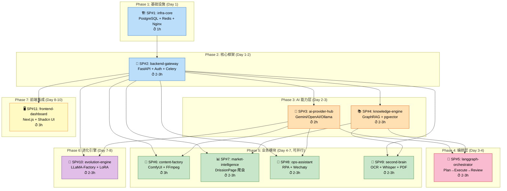

# 构建顺序图 / Build Order

## 依赖关系图 / Dependency Graph

## 推荐时间线 / Recommended Timeline

| 天数 | Phase | 子项目 | 估计时间 | 里程碑 |
|------|-------|--------|---------|--------|
| Day 1 | Phase 1-2 | SP#1 + SP#2 | 3-4h | ✅ 基础设施就绪，API 网关可用 |
| Day 2 | Phase 3 | SP#3 + SP#4 | 4-6h | ✅ AI 调用可用，知识检索可用 |
| Day 3-4 | Phase 4 | SP#5 | 2-3h | ✅ 思考环闭环完成 |
| Day 4-5 | Phase 5a | SP#6 + SP#7 | 5-6h | ✅ 内容生成 + 情报爬取 |
| Day 5-6 | Phase 5b | SP#8 + SP#9 | 4-6h | ✅ 运营自动化 + 知识入库 |
| Day 7 | Phase 6 | SP#10 | 2-3h | ✅ 进化引擎就绪 |
| Day 8-10 | Phase 7 | SP#11 | 3h | ✅ 前端仪表盘上线 |

**总计约 25-35 个 Vibe Coding 小时，建议 10 个工作日内完成 MVP。**

## 关键里程碑 / Key Milestones

1. **M1**: `docker compose up postgres redis` 正常运行
2. **M2**: `curl /api/v1/auth/register` 注册用户成功
3. **M3**: `curl /api/v1/ai/chat` AI 对话正常（至少一个 Provider）
4. **M4**: `curl /api/v1/knowledge/query` 知识检索返回结果
5. **M5**: `curl /api/v1/orchestrate/run` 端到端任务执行完成
6. **M6**: 各业务模块 API 独立可用
7. **M7**: `http://localhost:3000` 前端正常访问
8. **M8**: `docker compose up` 全部服务一键启动
