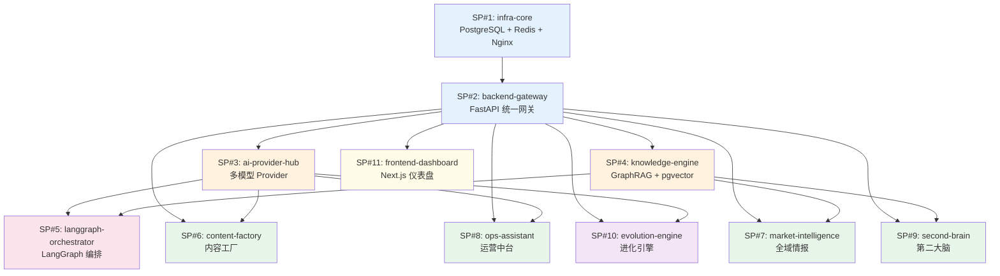

# Omni-Vibe OS Ultra — 项目拆解与构建指南

> 🧠 Thinking Process / 推理过程

## 架构分析与拆分策略

**自然模块边界识别：**

1. **基础设施层**：数据库、缓存、消息队列是所有业务的根基 → 独立为 SP#1
2. **后端核心层**：FastAPI 统一网关、认证、中间件是所有 API 的入口 → SP#2
3. **AI 抽象层**：多模型 Provider 是思考环和所有 AI 调用的基础 → SP#3
4. **知识引擎层**：GraphRAG + pgvector 是思考环和第二大脑的共用组件 → SP#4
5. **编排层**：LangGraph 是思考环的核心，依赖 AI Provider + 知识引擎 → SP#5
6. **四大业务模组**：各自独立，通过 API 和消息队列通信 → SP#6/7/8/9
7. **进化引擎**：依赖反馈日志，可后期独立构建 → SP#10
8. **前端仪表盘**：消费所有后端 API → SP#11

**通信协议设计：**
- 同步调用：REST API（FastAPI → FastAPI），统一 JSON 格式
- 异步任务：Celery + Redis（图片生成、视频处理、爬虫任务）
- 共享数据：PostgreSQL + pgvector（所有服务共用一个 DB，通过 schema 隔离）
- 事件通知：Redis Pub/Sub（轻量级事件，如任务完成通知）

**构建顺序原则：** 基础设施 → 核心框架 → AI 能力 → 知识引擎 → 编排层 → 业务模块 → 前端 → 进化

---

# Part 1: 项目拆解总览

## 1.1 子项目列表

| # | 子项目名称 | 一句话描述 | 对应模组 | 预估时间 | 依赖 |
|---|-----------|-----------|---------|---------|------|
| 1 | `infra-core` | Docker 基础设施：PostgreSQL + pgvector + Redis + Nginx | 基础设施 | 1h | 无 |
| 2 | `backend-gateway` | FastAPI 统一网关：认证、中间件、错误处理、DB 迁移 | 执行环 | 2-3h | SP#1 |
| 3 | `ai-provider-hub` | 多模型 Provider 统一抽象层（Gemini/OpenAI/Ollama） | 思考环 | 2h | SP#2 |
| 4 | `knowledge-engine` | GraphRAG + pgvector 知识检索引擎 | 思考环/第二大脑 | 2-3h | SP#2 |
| 5 | `langgraph-orchestrator` | LangGraph 任务编排：Controller + Reviewer Agent | 思考环 | 2-3h | SP#3, SP#4 |
| 6 | `content-factory` | ComfyUI 本地生图 + Midjourney + Kling 视频 + FFmpeg | 内容工厂 | 3h | SP#2, SP#3 |
| 7 | `market-intelligence` | DrissionPage 爬虫 + 评论分析 + 竞品监控 | 全域情报 | 2-3h | SP#2, SP#4 |
| 8 | `ops-assistant` | RPA 自动改价/回复 + Wechaty 私域管理 | 运营中台 | 2-3h | SP#2, SP#3 |
| 9 | `second-brain` | 本地 OCR + Whisper V3 + PDF 解析 + 知识入库 | 第二大脑 | 2-3h | SP#2, SP#4 |
| 10 | `evolution-engine` | 反馈收集 + LLaMA-Factory 夜间微调 + LoRA 管理 | 进化环 | 2-3h | SP#2, SP#3 |
| 11 | `frontend-dashboard` | Next.js 14 + Shadcn UI 统一仪表盘 | 前端 | 3h | SP#2 |

## 1.2 依赖关系图



## 1.3 推荐构建顺序

```
Phase 1 (基础) ─── SP#1: infra-core ─── SP#2: backend-gateway
Phase 2 (AI层) ─── SP#3: ai-provider-hub ─── SP#4: knowledge-engine
Phase 3 (编排) ─── SP#5: langgraph-orchestrator
Phase 4 (业务) ─── SP#6 / SP#7 / SP#8 / SP#9 (可并行)
Phase 5 (进化) ─── SP#10: evolution-engine
Phase 6 (前端) ─── SP#11: frontend-dashboard
```

> Phase 4 的四个子项目可以并行开发，互不依赖。

---

## 1.4 各子项目详细定义

### Sub-Project #1: infra-core
- **一句话描述**：Docker Compose 编排的基础设施层，包含 PostgreSQL（含 pgvector 扩展）、Redis、Celery Worker、Nginx 反向代理
- **核心功能**：
  1. PostgreSQL 15 + pgvector 扩展自动初始化
  2. Redis 7 作为缓存和 Celery Broker
  3. Nginx 反向代理配置（路由到各后端服务）
  4. 健康检查脚本与启动依赖管理
  5. 统一的 `.env.example` 环境变量模板
- **技术栈**：Docker Compose, PostgreSQL 15, pgvector, Redis 7, Nginx
- **依赖项**：无，可独立启动
- **预估 Vibe Coding 时间**：1 小时
- **交付物**：可运行的 `docker compose up` 命令，通过 `psql` 连接验证数据库 + `redis-cli ping` 验证缓存
- **对应原始模组**：执行环（基础设施）

### Sub-Project #2: backend-gateway
- **一句话描述**：FastAPI 统一网关服务，提供认证、中间件、数据库 ORM、迁移、统一错误处理和 Celery 异步任务框架
- **核心功能**：
  1. FastAPI 应用骨架 + CORS + 请求日志中间件
  2. JWT 认证（注册/登录/刷新 Token）
  3. SQLAlchemy 2.0 ORM + Alembic 迁移框架
  4. 统一错误响应格式 `{"code": 400, "message": "...", "detail": "..."}`
  5. Celery 任务框架 + Redis Broker 配置
- **技术栈**：FastAPI, SQLAlchemy 2.0, Alembic, Pydantic V2, Celery, python-jose
- **依赖项**：SP#1（PostgreSQL, Redis）
- **预估 Vibe Coding 时间**：2-3 小时
- **交付物**：可运行的 FastAPI 服务，通过 `curl` 调用 `/api/v1/auth/register` + `/health` 验证
- **对应原始模组**：执行环

### Sub-Project #3: ai-provider-hub
- **一句话描述**：多 AI 模型统一抽象层，通过 Provider 模式支持 Gemini、OpenAI、Ollama 的无缝切换，含流式输出
- **核心功能**：
  1. 抽象 `BaseProvider` 接口（chat / embedding / vision）
  2. GeminiProvider（google-genai SDK）
  3. OpenAIProvider（openai SDK）
  4. OllamaProvider（本地 HTTP 调用）
  5. 统一流式输出（SSE）+ Token 用量追踪 + 自动 Fallback
- **技术栈**：FastAPI, google-genai, openai, httpx, SSE
- **依赖项**：SP#2（网关框架）
- **预估 Vibe Coding 时间**：2 小时
- **交付物**：可运行的 `/api/v1/ai/chat` 端点，通过 `curl` 传入不同 `provider` 参数验证切换
- **对应原始模组**：思考环

### Sub-Project #4: knowledge-engine
- **一句话描述**：基于 pgvector + GraphRAG 的知识检索引擎，支持文档入库、向量检索和图谱查询
- **核心功能**：
  1. pgvector 向量存储与相似度检索
  2. 文档分块（chunking）+ Embedding 生成管道
  3. 微软 GraphRAG 风格的实体-关系抽取
  4. 混合检索（向量相似 + 关键词 + 图谱遍历）
  5. 知识库 CRUD API
- **技术栈**：FastAPI, pgvector, LangChain, NetworkX, SQLAlchemy
- **依赖项**：SP#2（网关框架）, SP#3（Embedding Provider）
- **预估 Vibe Coding 时间**：2-3 小时
- **交付物**：可运行的 `/api/v1/knowledge/ingest` + `/api/v1/knowledge/query` 端点
- **对应原始模组**：思考环 / 第二大脑

### Sub-Project #5: langgraph-orchestrator
- **一句话描述**：基于 LangGraph 的任务编排引擎，实现 Controller → Tool Dispatch → Reviewer 三步闭环
- **核心功能**：
  1. LangGraph StateGraph 定义（Plan → Execute → Review → Decide）
  2. Controller Agent（意图识别 + 任务规划）
  3. Reviewer Agent（输出质量评估 + 重试决策）
  4. 工具注册表（动态注册各子项目的 API 为可调用工具）
  5. 任务历史日志（PostgreSQL 持久化）
- **技术栈**：LangGraph, LangChain, FastAPI
- **依赖项**：SP#3（AI Provider）, SP#4（知识引擎）
- **预估 Vibe Coding 时间**：2-3 小时
- **交付物**：可运行的 `/api/v1/orchestrate/run` 端点，提交任务并获取多步执行结果
- **对应原始模组**：思考环

### Sub-Project #6: content-factory
- **一句话描述**：AI 内容生产工厂，集成 ComfyUI 本地生图、外部 API 重绘、Kling 视频生成和 FFmpeg 后处理
- **核心功能**：
  1. ComfyUI API 调用封装（本地 Docker）
  2. Midjourney API 代理（通过第三方 API）
  3. Kling 视频生成 API 集成
  4. FFmpeg 视频剪辑管道（水印、拼接、字幕）
  5. Celery 异步任务队列 + 进度回调
- **技术栈**：FastAPI, Celery, ComfyUI, FFmpeg, httpx
- **依赖项**：SP#2（网关）, SP#3（AI Provider）
- **预估 Vibe Coding 时间**：3 小时
- **交付物**：可运行的 `/api/v1/content/generate-image` + `/api/v1/content/tasks/{id}` 端点
- **对应原始模组**：内容工厂

### Sub-Project #7: market-intelligence
- **一句话描述**：全域电商情报系统，使用 DrissionPage 爬取商品/评论数据并通过 GraphRAG 进行分析
- **核心功能**：
  1. DrissionPage 爬虫框架（支持多平台配置）
  2. 评论抽取 + 情感分析管道
  3. 竞品价格监控 + 变动通知
  4. 爬取数据自动入库 GraphRAG
  5. Celery 定时爬取任务调度
- **技术栈**：FastAPI, DrissionPage, Celery, LangChain
- **依赖项**：SP#2（网关）, SP#4（知识引擎）
- **预估 Vibe Coding 时间**：2-3 小时
- **交付物**：可运行的 `/api/v1/intel/crawl` + `/api/v1/intel/analyze` 端点
- **对应原始模组**：全域情报

### Sub-Project #8: ops-assistant
- **一句话描述**：电商运营自动化助手，提供 RPA 自动改价/自动回复和 Wechaty 私域消息管理
- **核心功能**：
  1. RPA 任务引擎（DrissionPage 操作电商后台）
  2. 自动回复模板 + AI 生成回复
  3. 自动改价策略引擎（规则 + AI 决策）
  4. Wechaty 微信机器人集成
  5. 操作日志 + 审计追踪
- **技术栈**：FastAPI, DrissionPage, Wechaty (Node.js sidecar), Celery
- **依赖项**：SP#2（网关）, SP#3（AI Provider）
- **预估 Vibe Coding 时间**：2-3 小时
- **交付物**：可运行的 `/api/v1/ops/auto-reply` + `/api/v1/ops/price-adjust` 端点
- **对应原始模组**：运营中台

### Sub-Project #9: second-brain
- **一句话描述**：个人第二大脑，集成 OCR、语音转写、PDF 解析，将所有非结构化数据入库知识引擎
- **核心功能**：
  1. PaddleOCR / Tesseract 本地 OCR
  2. Whisper V3 本地语音转写
  3. PDF / DOCX / Markdown 解析管道
  4. 自动摘要 + 关键词提取
  5. 统一入库知识引擎（调用 SP#4 API）
- **技术栈**：FastAPI, PaddleOCR, faster-whisper, PyMuPDF, Celery
- **依赖项**：SP#2（网关）, SP#4（知识引擎）
- **预估 Vibe Coding 时间**：2-3 小时
- **交付物**：可运行的 `/api/v1/brain/upload` + `/api/v1/brain/transcribe` 端点
- **对应原始模组**：第二大脑

### Sub-Project #10: evolution-engine
- **一句话描述**：自进化引擎，收集用户反馈日志，夜间通过 LLaMA-Factory 微调生成 LoRA 适配器
- **核心功能**：
  1. 反馈日志收集 API（评分 + 文本反馈）
  2. 训练数据集自动构建（对话 → SFT 格式）
  3. LLaMA-Factory 夜间微调 Job（Celery Beat）
  4. LoRA 适配器版本管理 + 热加载
  5. A/B 测试框架（新旧模型对比）
- **技术栈**：FastAPI, LLaMA-Factory, Celery Beat, SQLAlchemy
- **依赖项**：SP#2（网关）, SP#3（AI Provider）
- **预估 Vibe Coding 时间**：2-3 小时
- **交付物**：可运行的 `/api/v1/evolution/feedback` + `/api/v1/evolution/train` 端点
- **对应原始模组**：进化环

### Sub-Project #11: frontend-dashboard
- **一句话描述**：Next.js 14 + Shadcn UI 统一仪表盘，消费所有后端 API 提供可视化操作界面
- **核心功能**：
  1. App Router + 布局系统（Sidebar + TopBar）
  2. 认证页面（登录/注册）+ JWT 管理
  3. Dashboard 总览页（各子系统状态卡片）
  4. 各模组操作页（内容工厂、情报、运营、大脑）
  5. AI 对话界面（流式输出 + Markdown 渲染）
- **技术栈**：Next.js 14, Shadcn UI, Tailwind CSS, TanStack Query, Zustand
- **依赖项**：SP#2（后端 API）
- **预估 Vibe Coding 时间**：3 小时
- **交付物**：可运行的 Next.js 应用，通过浏览器访问 `http://localhost:3000` 验证
- **对应原始模组**：前端
